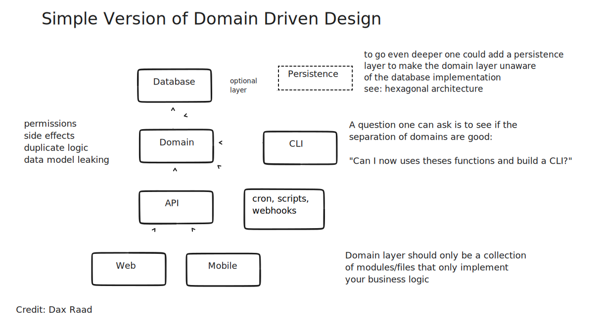

# CDK Examples

This project demonstrates how to structure your CDK project with Turborepo.

## Project Structure

The project is structured as follows:

- `iac/` - contains the CDK project and everything related to the backend infrastructure
- `services/` - contains the services that are deployed to the backend infrastructure

Services are structured in a very simplified [DDD](https://en.wikipedia.org/wiki/Domain-driven_design) manner. This is inspired by a great [introduction to DDD by Dax Raad](https://www.youtube.com/watch?v=MC_dS5G1jqw).

## Stacks

Every example is a separate stack.
The project contains the following stacks:

- `PolicyStack` - contains infrastrcuture for the policy service. It is intended to be used to update or enforce AWS policies e.g. change the retention of log groups globally or enforce a specific tag on all resources.

## FYI

- The CDK still has some problems with a monorepo setup. You need to install `esbuild` on the root of the project in order to build your `NodeJSFunctions`. See [this pr](https://github.com/aws/aws-cdk/pull/18216/files)